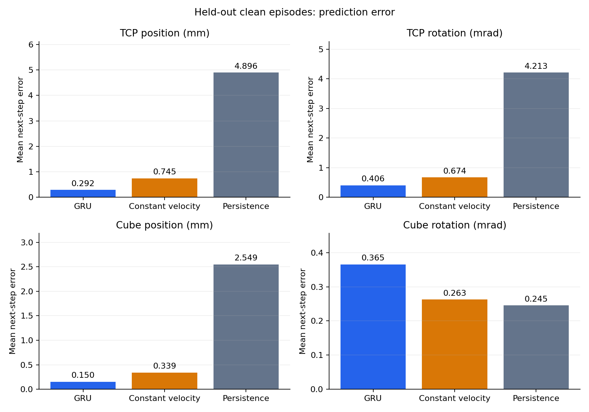
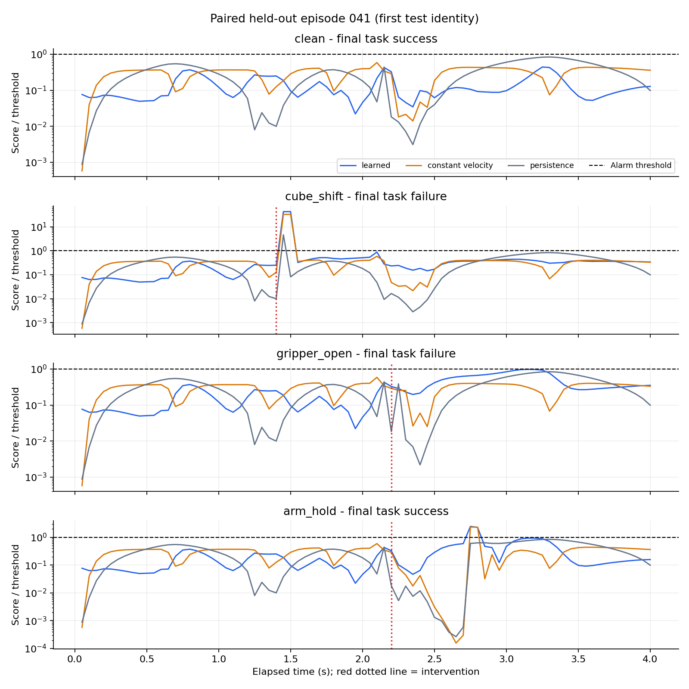
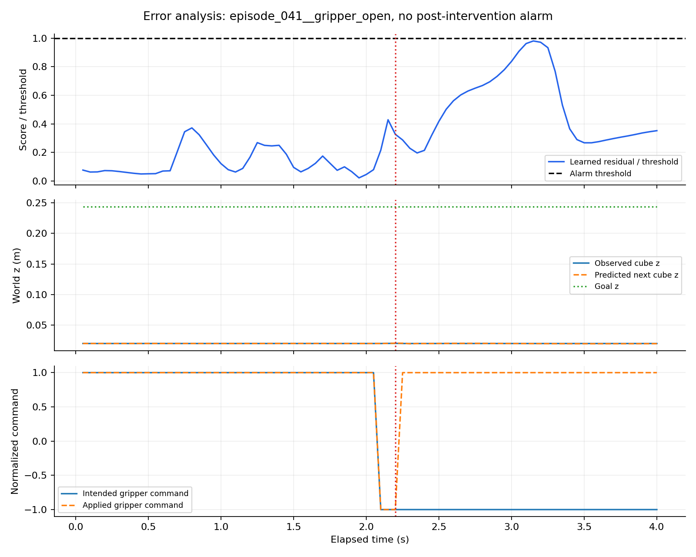

# Held-out PickCube failure-detection results

The complete state-based prototype runs from official clean demonstrations to causal
next-pose prediction, clean-only threshold calibration, perturbed replay, and evaluation.
**Residual alarms are not yet a reliable classifier of eventual task failure.**

The trained checkpoint and thresholds were fixed before scoring the test set.
There are 100 clean episodes: 60 train, 10 validation, 15 calibration, 15 test.
The 15 test identities each have four paired replays (60 trials total).
They produced 30 final task failures and 30 successes. All 15 unperturbed controls
reproduced their source states, RGB, rewards, and flags exactly.

## Detection results

| Method | Failures detected after injection | Episode-alarm precision for final failure | Clean control false alarms | Alarms on recovered perturbations | Median delay on detected failures |
|---|---:|---:|---:|---:|---:|
| learned | 23/30 (76.7%) | 61.5% | 2/15 | 13/15 | 0.05 s |
| constant velocity | 20/30 (66.7%) | 60.0% | 1/15 | 13/15 | 0.05 s |
| persistence | 20/30 (66.7%) | 87.0% | 1/15 | 2/15 | 0.05 s |

The learned detector has 4 perturbed trials with alarms before injection.
Counting any alarm anywhere gives 24/30 task-failure recall,
but the table uses the stricter post-injection count to avoid crediting premature alarms.
Latency begins when the intervention is applied before action t and ends when the
post-step observation triggers an alarm. At 20 Hz the minimum is 0.05 seconds;
the reported median is conditional on detection, not a measured semantic failure-onset delay.

## Held-out clean prediction errors

| Error | GRU | Constant velocity | Persistence |
|---|---:|---:|---:|
| TCP position (mm) | 0.2916 | 0.7446 | 4.8957 |
| TCP rotation (mrad) | 0.4062 | 0.6740 | 4.2131 |
| Cube position (mm) | 0.1497 | 0.3390 | 2.5487 |
| Cube rotation (mrad) | 0.3655 | 0.2628 | 0.2453 |

The GRU improves position forecasting and TCP rotation; cube rotation is worse
than the simpler baselines. These are one-step, observation-conditioned predictions.





The trace figure uses the first test identity, selected before inspecting detector scores.
A score/threshold ratio above 1 triggers an alarm. Successful recovery after an arm
stall is still abnormal motion, so treating every alarm as eventual task failure
produces false positives.

## Failure analysis and limits

- The learned detector misses post-injection detection on 7 of 30 failed trials.
- One-step predictions condition on the observed state. A failed but stationary cube
  can become easy to predict even while it remains far from the goal.
- Output targets are TCP and cube poses; gripper joint positions are inputs, not
  prediction targets. Gripper faults may not create a large immediate pose residual.
- Only 15 independent test identities are used. Their four conditions are paired,
  not 60 independent examples. Treat rates as small-sample research results.
- The designed test set has 50% task-failure prevalence; its precision does not
  estimate deployment precision when failures are rare.
- Calibration uses 15 clean episode maxima, with no certified low false-alarm guarantee.
- Inputs are privileged simulator state from one task and robot. RGB is recorded
  but unused by this baseline. Cross-task and real-robot generalization are untested.



The error-analysis figure selects the first failed trial with no post-injection
alarm. This is explicit diagnostic selection, not a representative accuracy claim.

## Reproduce / use

Use the environment setup in README.md and commands in docs/STEP2.md and docs/STEP3.md.
After those outputs exist:

```bash
python scripts/evaluate_detector.py
python scripts/plot_results.py
python scripts/score_episode.py data/perturbed/episode_041__cube_shift.npz --output runs/scored_cube_shift.npz
python -m unittest discover -s tests -v
```

Evaluation/scoring preserve existing results; choose new --output and --trace-dir
paths for a repeat. plot_results.py regenerates derived figures and this report.

Full results: results/evaluation.json; thresholds: results/calibration.json;
checkpoint: artifacts/predictor.pt; streaming scorer: scripts/score_episode.py.
Each streaming forecast is computed before comparing it with observation t+1.
Tests check causal features and recurrent streaming equivalence. Actual perturbed
episode forecasts and alarm flags were also compared against batch evaluation.

Trace NPZs under runs/evaluation contain predicted_pose and observed_pose (T,14),
TCP [xyz,wxyz] followed by cube [xyz,wxyz]; errors (T,4) in the units above;
score (T,), alarm (T,), threshold (scalar), time_seconds (T,), injection_step,
control_freq, condition, and final_success. These are evaluation artifacts,
not additional training data.
